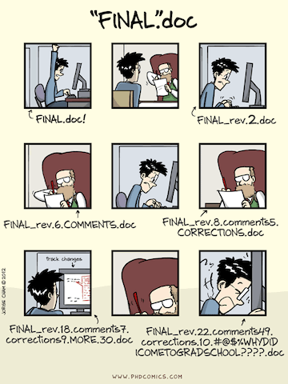
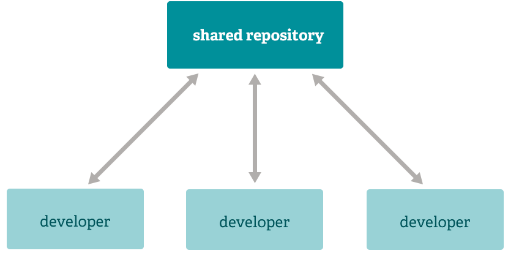
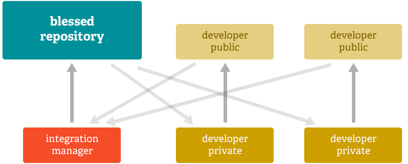
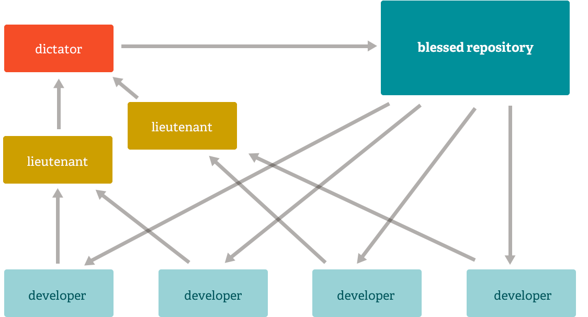

# Version Control with git

### Andrea Galbusera

***

gizero@gmail.com

[@gizero76](https://twitter.com/gizero76)

https://github.com/gizero

Note: Good morning everyone, welcome to the course "version control with giti".
I hope you'll enjoy the time we'll spend together. Before moving into the
schedule, let me briefly introduce myself... Here is how you can reach me and
here is a short resume of my experience...

---

# The Speaker

embedded systems designer/architect

spare time full-stack web developer

doing SCM since 2002 (in some way teaching it)

using `git` since 2010

continuously researching into SCM technologies and best practices

Note: everyday job is kind of a niche of software development... stress on how
the tooling is of interest for me and how it can help in managing projects.
but most interestly for this course.
I never regreted the moment I switched to git from other solutions. Ok, now that
you know something about me, let's give some pointers to this work

---

This presentation is available at:

http://gizero.github.io/git-course-smartlis/

Sources:

https://github.com/gizero/git-course-smartlis/

License:

Copyright &copy; 2017
[Creative Commons 3.0](http://creativecommons.org/licenses/by/3.0/), CC-BY

---

# Agenda

## Day 1
- disclaimer
- what's this all about?
- (brief) history of SCM
- git without git
- workshop

---

# Disclaimers

- work in progress teaching experiment
<!-- .element: class="fragment" data-fragment-index="1" -->

- many concept are tool agnostic...
<!-- .element: class="fragment" data-fragment-index="2" -->

- ...but this is about `git`
<!-- .element: class="fragment" data-fragment-index="3" -->

- client agnostic
<!-- .element: class="fragment" data-fragment-index="4" -->

- ...but heavily biased towards command line
<!-- .element: class="fragment" data-fragment-index="5" -->

Note: git learning curve is often considered to be steep. My opinion which I
share with other experienced git trainers is that the tool should not be the main
focus for a novice. Here we try to get into the git topic with a
teaching experiment... Hopefully things will become simpler and git command
details will be just a man page away from you.
Answers some of you provided to the preliminary questionaire will come handy for
tuning the way to teach of some course topics.
So what will us be doing in practice?

---

# In This Course We

- talk interactively to each other
- sketch some diagrams
- build some reasonable workflow strategies

Note: Wow, I thought this was about those cryptic git commands. Well, yes and
no. At least not right now: you'll have to be patien, but I hope it'll be worth
the waiting.

---

# Then...

- we will learn the commands to implement them

Note: invece di concentrarsi sui comandi ci focalizzeremo maggiormente sul
perchè vogliamo fare qualcosa e poi su come implementarla. Useremo qualche
diagramma per stimolare gli stessi processi di apprendimento che normalmente
portano alcuni di noi a preferire le GUI rispetto alle interfacce CLI.

---

# Vocabulary

- Source Control
- Version Control
- Revision Control
- Source Code Management

Note: con il termine SCM comprendiamo anche pratiche e strumenti più o meno
correlati con il controllo di revisione, quali il deployment e il ticket/issue
tracking. Quindi vediamo cosa ci permettono di fare questi strumenti che rientrano
nella classificazione appena introdotta...
Now that we know all of these are synonyms, you might legitimately ask:

---

# What is version control?

Note: Ask, “Who uses ‘undo’ in their editor?” All say “Me”. ‘Undo’ is the
simplest form of version control.
Give learners a five-minute overview of what version control does for them
before diving into the watch-and-do practicals. Most of you have tried to
co-author papers by emailing files back and forth, or will have biked into the
office only to realize that the USB key with last night’s work is still on the
kitchen table. Or what about all those directories with names like
“final version”, “final version revised”, “final version with reviewer three’s
corrections”, “really final version”, and, “come on this really has to be the
last version” to motivate version control as a better way to collaborate and as
a better way to back work up.

---

---

# With VCS tools we...

- keep track of changes over time
- backup older files
- work with others on a project simultaneously
- keep track of authorship
- deal with big (or even small) changes that break things
- move things from one host to another

Note: hosts can be either development, staging or production hosts. Supply chain
is intrinsically bound to how a change flows from the designer/developer mind
down to the production.
Authorship has psycological implication we should learn how to overcome
Version control is like an unlimited ‘undo’.
Version control also allows many people to work in parallel.

---

# In brief, this is all about...

# ...managing the change
<!-- .element: class="fragment" data-fragment-index="1" -->

Note: mention cool concepts like "design for changeability", but most
importantly focus the audience to the unavoidable changing nature of their job
artifacts.

Then you might ask: is this cool thing good for everyone? Well, yes, indeed!

---

# working in team?

- don't step on each other's feet
- minimize coordination overhead
- reduce onboarding costs for new resources
- leverage and improve team skills with peer review

---

# working solo?

- productivity tool
- easily switch between tasks
  + parallelizing activities
- quickly react to urgencies
  + make a quick fix while working on a new feature

---

# Authorship

- keep track of "who made what"
- allow "blaming" changesets

---

## do I really need a tool?
### (alternatives)

Frequently backup your files (caveman's SCM)

- straightforward: anyone knows how to do it
- error prone (write to wrong dir)
- what does "frequently" mean?
- how to deal with backups (housekeeping)
- hard to find useful things among backups
- doesn't address the collaboration issue

Note: Does your boss really need to invest money on a tool? Can't we really
solve the same problems with ready made tools every computer can provide?

---

# Distributed vs Centralized

Note:
Automated version control systems are nothing new. Tools like RCS, CVS, or
Subversion have been around since the early 1980s and are used by many large
companies.
If anyone of you have had previous experience with other SCM tools
before using git you probably read that those tools belong to two broad
categories...
However, many of these are now becoming considered as legacy systems
due to various limitations in their capabilities. In particular, the more modern
systems, such as Git and Mercurial are distributed, meaning that they do not
need a centralized server to host the repository. These modern systems also
include powerful merging tools that make it possible for multiple authors to
work within the same files concurrently.

--->

# Centralized VCS

- there is only one repository every contributor connects to
- there is a single history of revisions
- easy to administer and manage access control
- single point of failure

--->

# Centralized VCS

- SVN
- TFS
- CVS
- RCS (late 70s)

--->

# Distributed VCS

- every contributor mirrors the entire history
- every clone is a full backup

--->

# Distributed VCS

- git
- Mercurial
- BitKeeper
- Veracity

---

# So what are GitHub, BitBucket or Gitlab?

Note: try to clarify where git ends and GitHub and friends do begin

---

# Distributed == anarchy?

Note:
When we talk about having enterprise work spread across different users/systems
managers usually and ligitimately turn their nose up... Can we 

---

## Distributed as the New Centralized

--->

## Integration Manager

--->

## Dictator and Lieutenants

---

## Exercise 1: outline your team

Who is in your team?

Note: dare un'idea di cosa vogliamo fare senza svelare i dettagli. Cerchiamo di
conoscere il team e il teamwork per caratterizzare i workflow di interesse.
Usiamo come riferimento un progetto reale che coinvolga un numero significativo
di persone oppure proviamo a immaginare un progetto imminente o anche fittizio
sul quale ragionare.

--->

## Exercise 1: outline your team

What are their roles?
+ developers
+ designers
+ project managers
+ clients

--->

## Exercise 1: outline your team

What task are they responsible for?
+ writing code
+ reviewing code
+ pushing code to servers
+ fixing broken code

Note: prendete carta e penna e scrivete i nomi delle persone coinvolte nel
progetto, indicando i loro ruoli e le attività delle quali sono responsabili:
utilizzando i verbi come download work, create snapshot, share work

--->

## Exercise 1: outline your team

What constraints are you dealing with?
+ how do you schedule your deadlines?
+ where is your code hosted?
+ do you have a staging instance?
+ where are the server you push to?
+ do you use a local development pattern?

Note: I tricked you and you just built a checklist of what you need to create a
workflow you can use with git

---

## Why the command line interface

It's a matter of taste but:
- as a programmer I don't trust GUIs
- it's elegant (clicking here and there becomes boring)
- allows progressively replacing yourself with scripts (automation)
- easier to write cheat sheets, share knowledge and ask the web for help (Stack Overflow)

Note:
git command line interface is structured into subcommands of the git command.
The first subcommand we need to introduce, even before trying to translate any
of the acivities we highlithed during the exercise is the configuration command.
Before you start using git for the first time on a computer, some configuration
steps should be carried out.

---

## Configuration
##### Identity
<!-- .element: class="fragment" data-fragment-index="1" -->
    $ git config --global user.name "John Doe"
    $ git config --global user.email johndoe@example.com
<!-- .element: class="fragment" data-fragment-index="1" -->

##### Editor
<!-- .element: class="fragment" data-fragment-index="2" -->
    $ git config --global core.editor vim
<!-- .element: class="fragment" data-fragment-index="2" -->

##### Merge tool
<!-- .element: class="fragment" data-fragment-index="3" -->
    $ gif config --global merge.tool vimdiff
<!-- .element: class="fragment" data-fragment-index="3" -->

##### Check current settings
<!-- .element: class="fragment" data-fragment-index="4" -->
    $ git config --list
    $ git config user.name
<!-- .element: class="fragment" data-fragment-index="4" -->

---

# Where are my settings?
- System setting       : `/etc/gitconfig`
- Global user settings : `~/.gitconfig`
- Repository settings  : `.git/config`
- Windows: `C:\Documents and Settings\$USER\.gitconfig`

---

# Get Help

    $ git

    $ git help

    $ git help clone

---

# For the impatients

    $ git init

<!-- .element: class="fragment" data-fragment-index="1" -->

    $ git add README

<!-- .element: class="fragment" data-fragment-index="2" -->

    $ git commit -m "This is my first commit"

<!-- .element: class="fragment" data-fragment-index="3" -->

Note:
Talk a little bit about the .git directory

---

# Work on existing projects

    $ git clone https://github.com/gizero/git-course-smartlis

---

# The Three States

---

# Status Lifecycle

---

# Hands-on session

--->

# Initialize repo

    $ git init

## `.git` gets created
    $ ls -la
    total 0
    drwxr-xr-x   3 gizero  staff   102B Jan 14 20:48 .
    drwxr-xr-x  18 gizero  staff   612B Jan 14 20:48 ..
    drwxr-xr-x   9 gizero  staff   306B Jan 14 20:48 .git

--->

# Check file status

    $ git status
 
+ Untracked - changes are not recorded by git
+ Tracked
    + unmodified - no changes since last snapshot
    + modified - modified since last snapshot
    + staged - a modified snapshot which is ready for commit

--->

# Check file status
    $ git status
    On branch master

    Initial commit

    nothing to commit (create/copy files and use "git add" to track)

--->

# Check file status
## Then create a new file
    $ touch README
    $ git status
    On branch master

    Initial commit

    Untracked files:
      (use "git add <file>..." to include in what will be committed)

              README

    nothing added to commit but untracked files present (use "git add"
    to track)

--->

# Adding a file
    $ git add README
## Check the status again
    $ git status
    On branch master

    Initial commit

    Changes to be committed:
      (use "git rm --cached <file>..." to unstage)

              new file:   README

--->

# Modify tracked file
    $ $EDITOR index.html
## What's the status now?
    $ git status
    On branch master
    Changes to be committed:
      (use "git reset HEAD <file>..." to unstage)

            new file:   README

    Changes not staged for commit:
      (use "git add <file>..." to update what will be committed)
      (use "git checkout -- <file>..." to discard changes in working
      directory)

            modified:   index.html

--->

# Stage Changes
    $ git add index.html
## And the status?
    $ git status
    $ git status
    On branch master
    Changes to be committed:
      (use "git reset HEAD <file>..." to unstage)

            new file:   README
            modified:   index.html

--->

# git add
### a multipurpose command

- git add to track new files
- git add to stage files
- git add to mark conflicts as resolved

--->

# Check changes
    $ git diff             # changes still unstaged

(shows nothing)

    $ git diff --cached    # changes staged for commit

(shows staged diffs)

--->

# Time to Commit
    $ git commit -m "That's fun, isn't it?"
    [master b795273] That's fun, isn't it?
     2 files changed, 10 insertions(+)
     create mode 100644 README

--->

# All in One
    $ git commit -a -m "fix stuff"
 
+ will stage and commit the files in a single operation
+ automatically stages modified and deleted files
+ does not affect untracked files
+ use with caution!

--->

# Fix last commit
    $ git commit --ammend
 
+ use when you mispelled your last commit message
+ you can also stage other changes before amending

--->

# Removing files
    $ git rm README            # removes from repo & working directory
    $ git rm --cached README   # removes from repo

--->

# Moving and renaming files
    $ git mv README README.txt
 
Is just a shorthand for:

    $ mv README README.txt
    $ git rm README
    $ git add README.txt

--->

# Ignoring files
    $ $EDITOR .gitignore
IDE files, build dir, local settings, etc...

<!-- .element: class="fragment" data-fragment-index="1" -->

    $ git add .gitignore
    $ git commit -m 'tell git to ignore these files'

<!-- .element: class="fragment" data-fragment-index="2" -->

--->

# View history
    $ git log

--->

# Undoing
## Removing a file from the stage
    $ git reset README

--->

# Undoing
## Reverting uncommitted changes
    $ git checkout README

--->

# Undoing
## Reverting a commit
    $ git revert b79527

--->

# Remotes
## List remotes
    $ git remote -v
## Add a remote
    $ git remote add <name> <url>

--->

## Fetch changes from remote
    $ git fetch <remote>
 
## Fetch + Merge with branch
    $ git pull <remote> <branch>
 
## Pushing
    $ git push <origin> <branch>

---

# Workshops
## Requirements
+ working git client (CLI)
+ text editor

---

# Workshop 1
## Start from scratch
+ create a new project
+ create a few commits on master
+ start working on a new "feature A"
+ implement "feature A" in a different way
+ merge one of the two implementation

---

# Workshop 2
## Work with existing repo
+ clone an existing project
+ navigate project's history
+ continue working on the project
